# 🛒 E-Commerce Backend Microservices

A scalable, event-driven e-commerce backend built using Spring Boot Microservices, Apache Kafka, Docker, PostgreSQL, and Spring Cloud.

---

## 🚀 Tech Stack

- Java 17
- Spring Boot
- Spring Security
- JWT Authentication
- Spring Cloud Gateway
- Eureka Server
- Apache Kafka
- Docker & Docker Compose
- PostgreSQL
- Swagger/OpenAPI
- k6 Load Testing

---

## 🏗️ Architecture


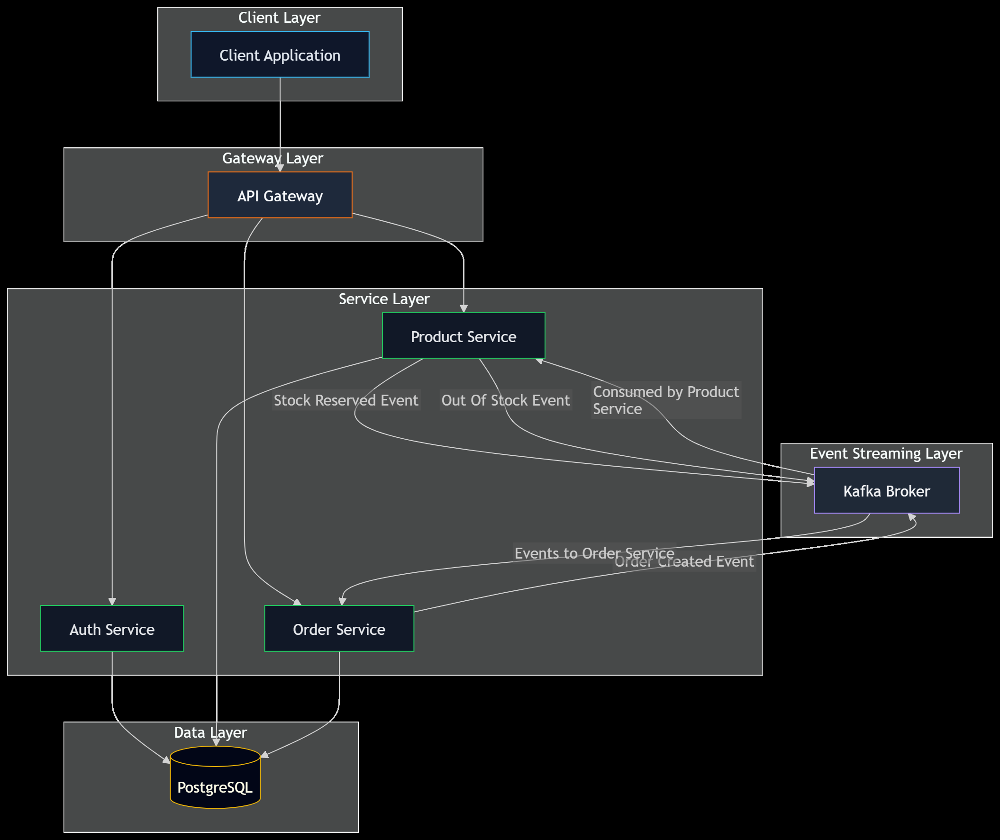
---

## ✨ Features

- User Authentication with JWT
- API Gateway
- Service Discovery (Eureka)
- Product Service
- Order Service
- Event-driven communication using Kafka
- Dockerized microservices
- Swagger API Documentation
- Load tested using k6

---

## 📸 Screenshots

### Docker Compose

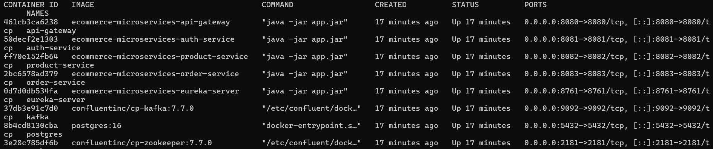

### Eureka Dashboard

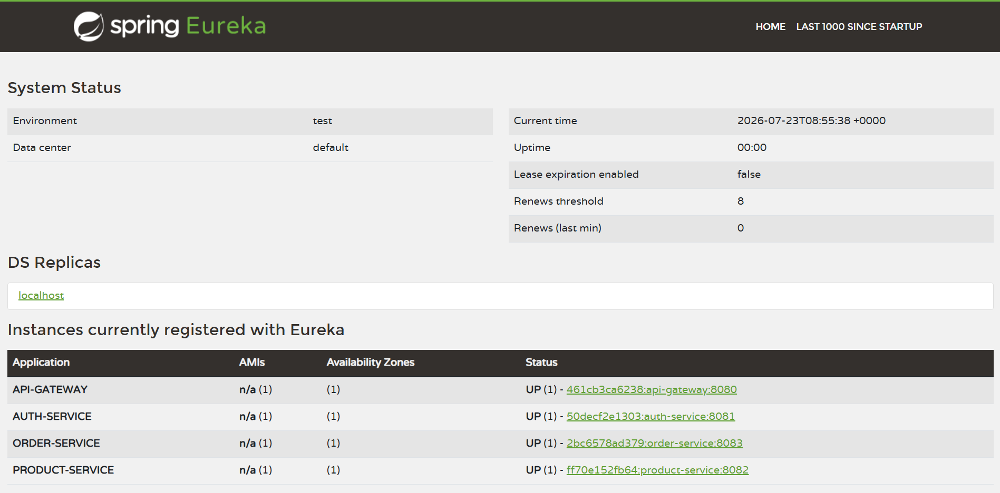

### Swagger UI
- User Authentication Service

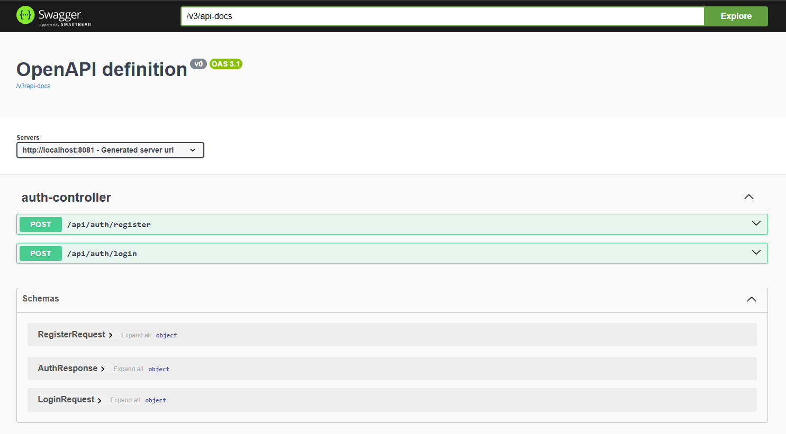

- Product Service

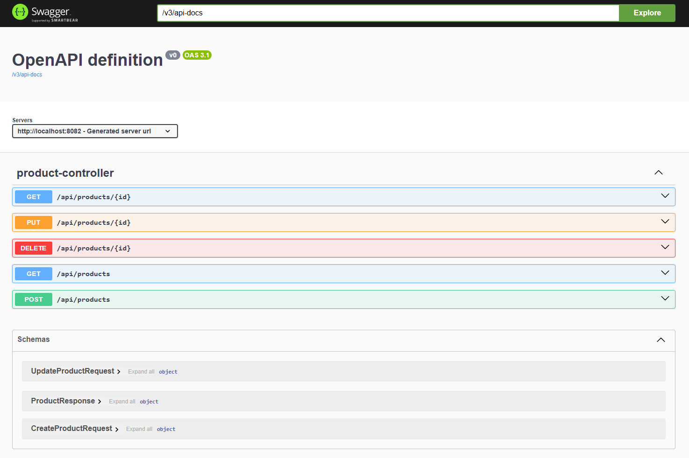

- Order Service

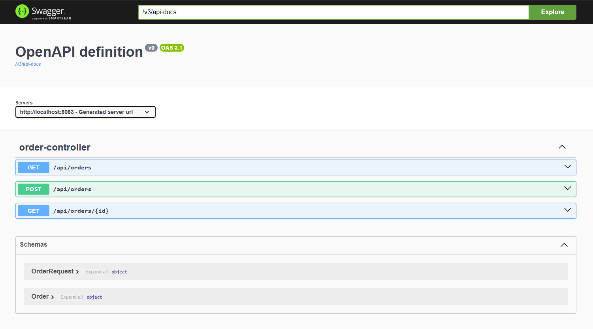

### Postman

- Register
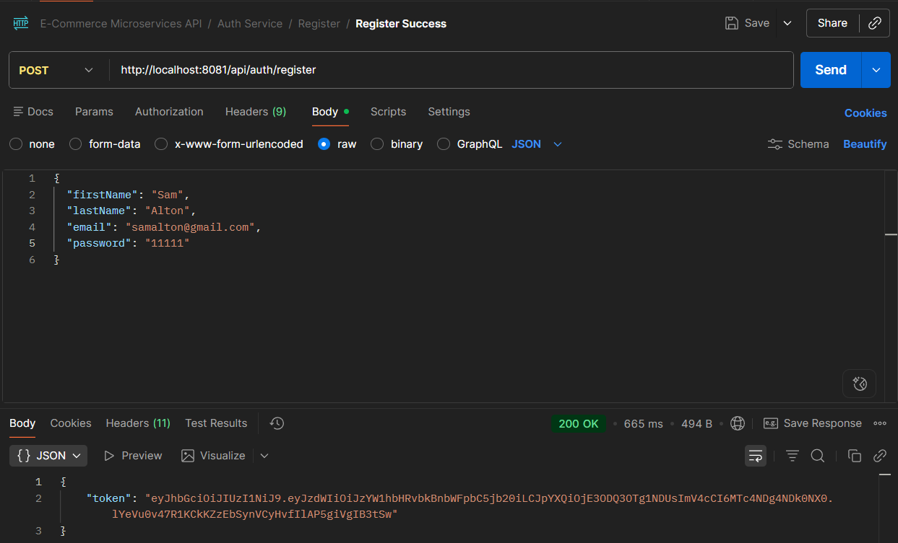
- Login
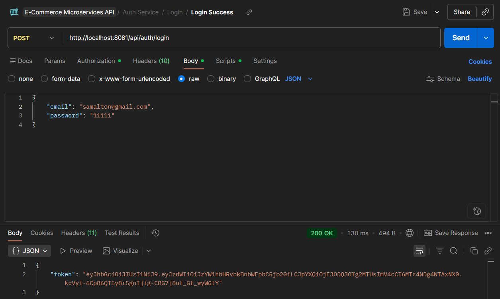
- Create Product
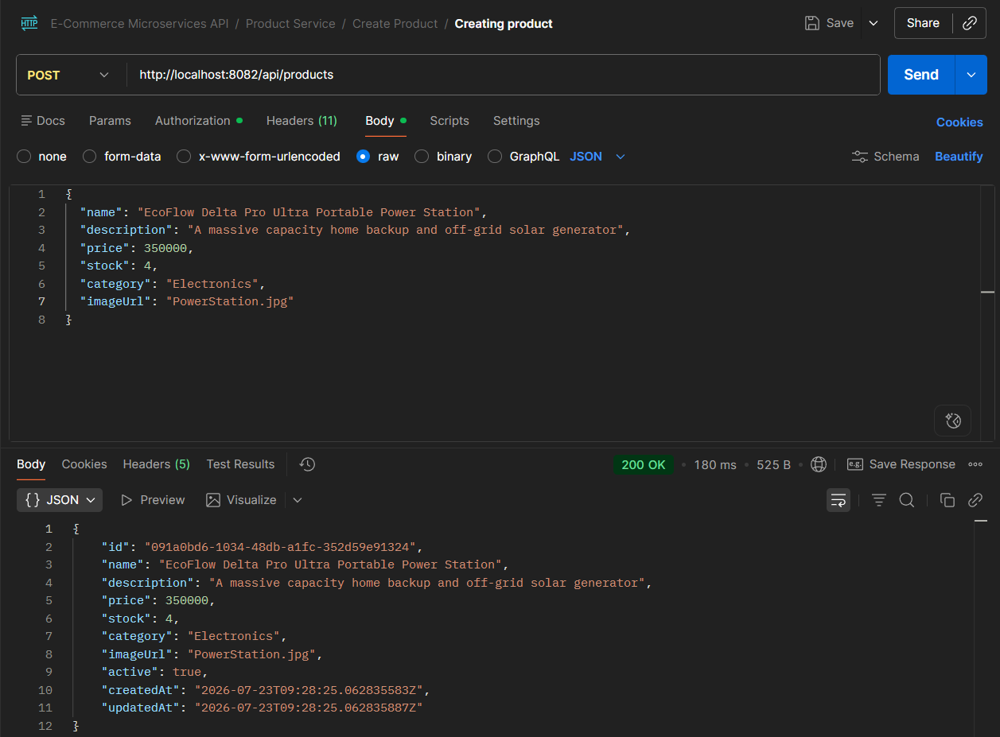
- Get Product
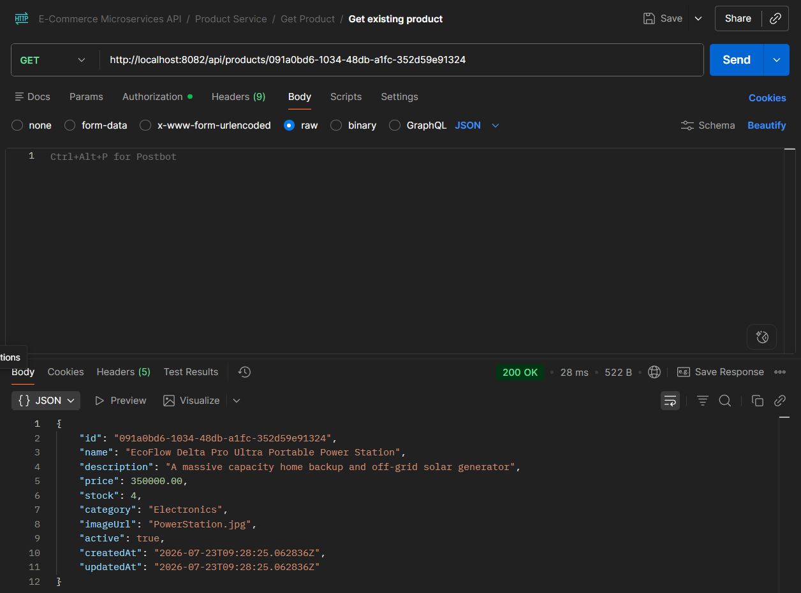
- Create Order
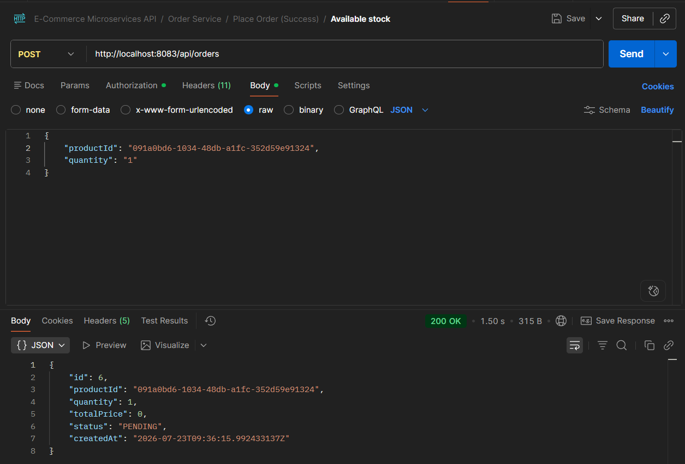

### k6 Performance Test

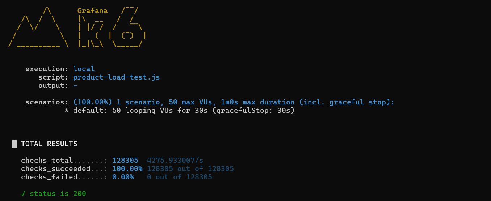

---

## ⚡ Performance

- 50 Virtual Users
- 30 seconds Load Test
- 128K+ Requests
- ~4276 Requests/sec
- 0% Request Failure
- ~11.5 ms Average Response Time

---

## Getting Started

### Clone the repository
```bash
git clone <https://github.com/Peerul-Hadhi-Rahman/e-commerce-microservices>
```

### Start the application
```bash
docker compose up -d
```

## Access the Services

| Service | URL |
|---------|-----|
| Eureka Dashboard | http://localhost:8761 |
| API Gateway | http://localhost:8080 |
| Auth Service - Swagger UI | http://localhost:8081/swagger-ui/index.html |
| Product Service - Swagger UI | http://localhost:8082/swagger-ui/index.html |
| Order Service - Swagger UI | http://localhost:8083/swagger-ui/index.html |


## 👨‍💻 Author

**Peerul Hadhi Rahman**

- 📧 Email: peerulrahman.sde@gmail.com
- 💼 LinkedIn: www.linkedin.com/in/peerulhadhirahman
- 💻 GitHub: https://github.com/Peerul-Hadhi-Rahman
- 🧩 LeetCode: https://leetcode.com/u/Peerul_Rahman/